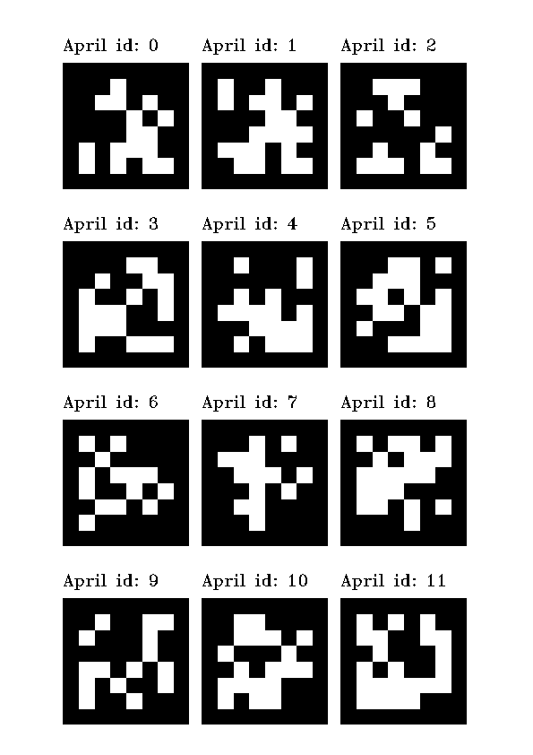
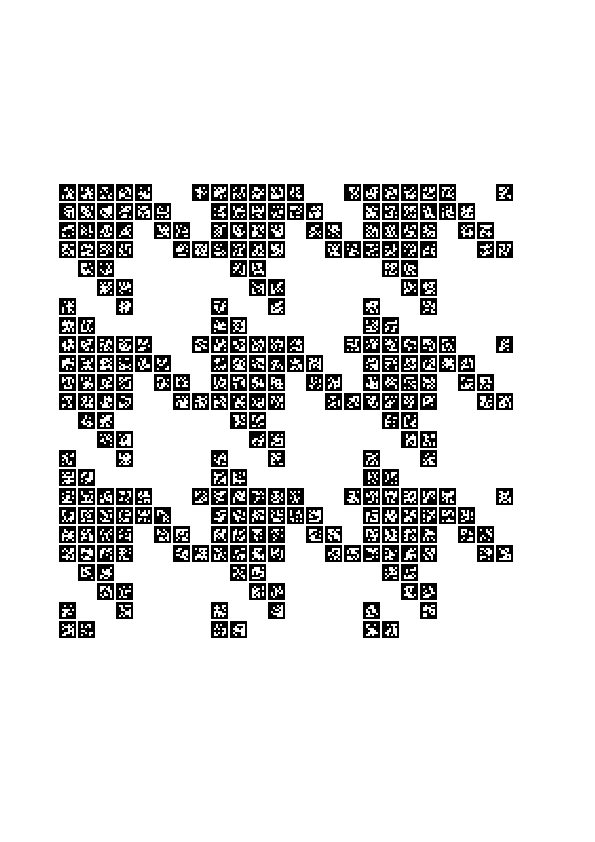

# CV Marker Pattern Generator

CV Marker Pattern Generator is a Python script for generating marker patterns for computer vision applications. 

by Rong-Hao Liang: r.liang@tue.nl

Update (Oct 13, 2023): Tested with OpenCV 4.6 and Python 3.9

The CV Marker Pattern Generator is a Python script that allows you to generate marker patterns for computer vision applications. These marker patterns can be used for camera calibration and object tracking tasks. This script is adapted from code originally written by Jes Fink-Jensen and Loe Feijs. It uses the OpenCV library for computer vision tasks.

## Install Python Environment

1. Install MiniConda
    - [https://docs.conda.io/projects/miniconda/en/latest/miniconda-other-installer-links.html](https://docs.conda.io/projects/miniconda/en/latest/miniconda-other-installer-links.html)
2. Open MiniConda Prompt / PowerShell (Windows) or Terminal (Mac)
   
```bash
conda create --name p39 python=3.9
conda activate p39
pip install opencv-contrib-python==4.6.0.66
```

## Usage Example

Here are two example commands to generate a marker pattern:

Example 1. This command generates a marker pattern with the specified parameters and saves it as "output_pattern.png."

```bash
python cv_marker_gen_pattern.py -o "output_pattern.png" -i 0 -t "DICT_APRILTAG_36h11" -d 72 -s 50 -m 5 -x 3 -y 4 --write-id -p "ful"
```



Example 2. This command will run the `cv_marker_gen_pattern.py` script to generate a marker pattern with the following characteristics: It's named "april_piedepole24x24.png," starts with an ID of 0, uses the "DICT_APRILTAG_36h11" dictionary, has a DPI of 72, each tag is 6 mm in size with 1 mm margins, doesn't write IDs on the tags, and creates a grid of 24x24 ArUco tags using the "PIED_DE_POULES_8X8" pattern.

```bash
python cv_marker_gen_pattern.py -o "april_piedepole24x24.png" -i 0 -t "DICT_APRILTAG_36h11" -d 72 -s 6 -m 1 --no-write-id -x 24 -y 24 -p "pdp8"
```


## Command Line Arguments

The script accepts various command line arguments to customize the generated marker pattern. Here is a brief description of each argument:

- `o`, `-output`: Path to the output image containing the CV Markers.
- `i`, `-id`: ID of the first marker to generate.
- `t`, `-type`: Type of CV marker to generate (default: DICT_ARUCO_ORIGINAL).
- `d`, `-dpi`: DPI (dots per inch) of the output print (default: 72).
- `s`, `-size`: Size in millimeters of the CV marker (default: 50).
- `m`, `-margin`: Size in millimeters of the margins between the CV markers (default: 5).
- `x`, `-x`: Number of CV markers in the X direction (default: 3).
- `y`, `-y`: Number of CV markers in the Y direction (default: 4).
- `-write-id`: Write the ID of the tag on the pattern (default: True).
- `p`, `-pattern`: Type of pattern (default: ful).

For the example 2, 
```bash
python cv_marker_gen_pattern.py -o "april_piedepole24x24.png" -i 0 -t "DICT_APRILTAG_36h11" -d 72 -s 6 -m 1 --no-write-id -x 24 -y 24 -p "pdp8"
```
- `cv_marker_gen_pattern.py`: This is the name of the Python script that you want to execute.
- `-o "april_piedepole24x24.png"`: This part specifies the output file name for the generated marker pattern. In this case, the output file will be named "april_piedepole24x24.png".
- `-i 0`: The `-i` flag specifies the ID of the first CV marker to generate. In this command, it's set to `0`.
- `-t "DICT_APRILTAG_36h11"`: The `-t` flag specifies the type of CV marker to generate. In this case, it's set to "DICT_APRILTAG_36h11", a specific type of CV marker dictionary.
- `-d 72`: The `-d` flag sets the output print's DPI (dots per inch) to 72. DPI determines the resolution of the printed image.
- `-s 6`: The `-s` flag specifies the size of the CV marker in millimeters. In this command, it's set to 6 mm.
- `-m 1`: The `-m` flag sets the size in millimeters of the margins between the CV markers. It's set to 1 mm.
- `--no-write-id`: This is a command line option that tells the script not to write the ID of the tag on the pattern. The IDs won't be printed on the tags if this option is used.
- `-x 24`: The `-x` flag specifies the number of CV markers in the X direction. In this command, it's set to 24.
- `-y 24`: The `-y` flag specifies the number of CV markers in the Y direction. In this command, it's also set to 24.
- `-p "pdp8"`: The `-p` flag specifies the type of pattern to use. This command is set to "pdp8", corresponding to the "PIED_DE_POULES_8X8" pattern.

## Supported Patterns
The CV Marker Pattern Generator supports various patterns, each designed for specific use cases. You can specify the pattern type using the -p or --pattern command line argument. Here are the supported patterns:

- `ful`: `FULL` Pattern. This pattern generates a full pattern matrix.
- `chk`: `CHECKERS_2X2` Pattern. Generates a checkerboard pattern with a 2x2 grid.
- `pt4`: `PUPPY_TOOTH_4X4` Pattern. Creates a 4x4 puppy tooth pattern.
- `pdp8`: `PIED_DE_POULES_8X8` Pattern. Generates an 8x8 pied de poules pattern.
- `hb4`: `HERRING_BONE_4X4` Pattern. Creates a 4x4 herringbone pattern.
- `bt4`: `BROKEN_TWILL_4X4` Pattern. Generates a 4x4 broken twill pattern.
- `ge`: `GOOZE_EYE_6X8` Pattern. Creates a 6x8 gooze eye pattern.
You can choose the pattern best suits your application by specifying the pattern type in the command line arguments. In the example.pdf, you will find the examples

## Supported Marker Types

The following marker types are supported:

- DICT_4X4_50
- DICT_4X4_100
- DICT_4X4_250
- DICT_4X4_1000
- DICT_5X5_50
- DICT_5X5_100
- DICT_5X5_250
- DICT_5X5_1000
- DICT_6X6_50
- DICT_6X6_100
- DICT_6X6_250
- DICT_6X6_1000
- DICT_7X7_50
- DICT_7X7_100
- DICT_7X7_250
- DICT_7X7_1000
- DICT_ARUCO_ORIGINAL
- DICT_APRILTAG_16h5
- DICT_APRILTAG_25h9
- DICT_APRILTAG_36h10
- DICT_APRILTAG_36h11

## Notes
- Please make sure you have installed the required libraries (Python, OpenCV) before running the script.
- Check that the grid dimensions and sizes fit within the specified DPI and A4 paper size, and the final print should not be scaled.
- If you encounter any issues, contact Rong-Hao Liang via (r.liang@tue.nl)

Enjoy using the CV Marker Pattern Generator for your computer vision projects!
